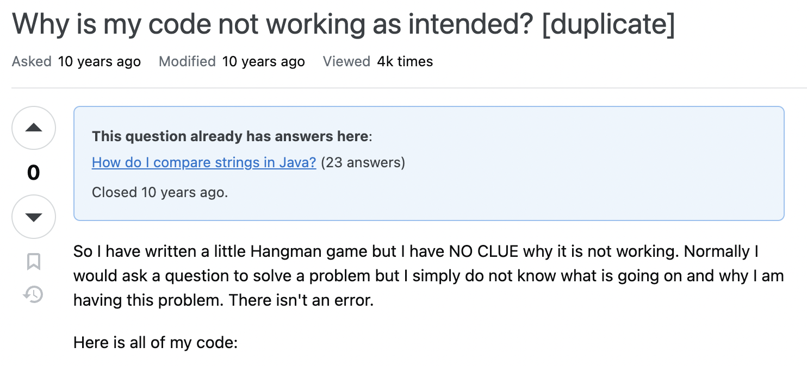

---
title: 'DS 202 - Homework #1'
author: "Manjul Balayar"
date: "02/05/24"
output: html_document
---

```{r setup, include=FALSE}
knitr::opts_chunk$set(echo = TRUE)
```

## Asking good questions

Asking good questions is a valuable skill to have. Asking questions in an online setting is both easier and harder than asking questions in person: we can prepare to ask a question, but we are also expected to prepare. The links posted here give some advice on how to ask good questions:

- Stack Overflow's [Asking a good question](http://stackoverflow.com/help/how-to-ask)
- R's [Posting guidelines](https://www.r-project.org/posting-guide.html)
- [Minimal complete verifiable example](https://stackoverflow.com/help/mcve), [minimal reproducible example](https://www.tidyverse.org/help/)

Follow these links and read through the advice given, then:

1. **(1 point) Which question did you pick (link to it).**

I chose the question titled "Why is my code not working as intended?" from Stack Overflow. Here's the link: [https://stackoverflow.com/questions/21058626/why-is-my-code-not-working-as-intended](https://stackoverflow.com/questions/21058626/why-is-my-code-not-working-as-intended)

2. **(1 point) Take a screenshot (or take a picture with your phone). Make sure to place the image in the same folder as your Rmarkdown file and include it in your (R)markdown file.**



3. **(3 points) Relate the readings to how the question is phrased: for that, write a paragraph on what a good question should do and then state what the stackoverflow question does. Identify at least three shortcomings.**

A good question should clearly articulate the problem, show what the user has tried, and provide a minimal, reproducible example. The chosen question fails in several ways:

- **Lack of specificity:** It does not specify what "not working as intended" means. There's no description of expected versus actual behavior.
- **No demonstration of effort:** The user states they have "NO CLUE" without indicating any debugging attempts or research done to solve the issue.
- **Broad and incomplete information:** Posting "all of my code" without pinpointing the error or problematic section makes it difficult for others to assist effectively.

4. **(3 points) Re-phrase the question to make it better. You can use placeholders for information that is not given in the original question, e.g., "version" or "platform".**

"Troubleshooting a Hangman Game Functionality Issue in [Programming Language]"

I'm experiencing unexpected behavior with my Hangman game in [Programming Language] and need assistance identifying the cause. The game should [describe expected behavior], but instead, it [describe actual behavior]. Here's a snippet of the code related to the problem (minimal, reproducible example):

```[Programming Language]
// Code snippet focusing on the issue
```

I've tried [describe any debugging attempts or research], but the issue persists. Any insights on what might be causing this discrepancy?

User will have to replace placeholders with specific details about the programming language, expected and actual behavior, and debugging attempts.)


